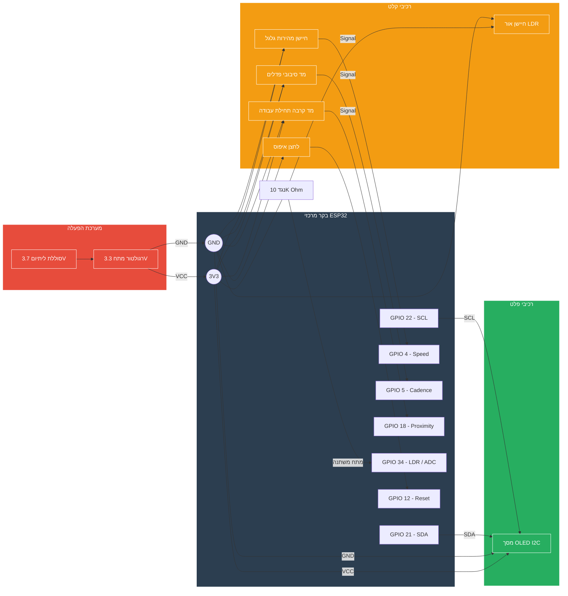

# bacicle_computer
ESP32 priject

```mermaid
graph LR
    subgraph ESP32_Pinout [בקר מרכזי ESP32]
        3V3((3V3))
        GND((GND))
        G21[GPIO 21 - SDA]
        G22[GPIO 22 - SCL]
        G4[GPIO 4 - Speed]
        G5[GPIO 5 - Cadence]
        G18[GPIO 18 - Proximity]
        G34[GPIO 34 - LDR / ADC]
        G12[GPIO 12 - Reset]
    end

    subgraph Power [מערכת הפעלה]
        Bat[סוללת ליתיום 3.7V] --> Reg[רגולטור מתח 3.3V]
        Reg -->|VCC| 3V3
        Reg -->|GND| GND
    end

    subgraph Inputs [רכיבי קלט]
        S_Speed[חיישן מהירות גלגל]
        S_Cadence[מד סיבובי פדלים]
        S_Prox[מד קרבה תחילת עבודה]
        S_LDR[חיישן אור LDR]
        Btn_Reset[לחצן איפוס]
    end

    subgraph Outputs [רכיבי פלט]
        Disp_OLED[מסך OLED I2C]
    end

    %% חיבורי מסך
    3V3 ----> |VCC| Disp_OLED
    GND ----> |GND| Disp_OLED
    G21 --> |SDA| Disp_OLED
    G22 --> |SCL| Disp_OLED

    %% חיבורי חיישנים דיגיטליים
    S_Speed -->|Signal| G4
    3V3 --> S_Speed
    GND --> S_Speed

    S_Cadence -->|Signal| G5
    3V3 --> S_Cadence
    GND --> S_Cadence

    S_Prox -->|Signal| G18
    3V3 --> S_Prox
    GND --> S_Prox

    %% חיבור חיישן אנלוגי עם נגד משוך
    3V3 --- Resistor[נגד 10K Ohm] ---> S_LDR
    Resistor --> |מתח משתנה| G34
    GND --> S_LDR

    %% חיבור לחצן איפוס
    Btn_Reset --> G12
    GND --> Btn_Reset
    
    %% עיצוב ויזואלי
    classDef esp fill:#2c3e50,stroke:#fff,stroke-width:2px,color:#fff;
    classDef pwr fill:#e74c3c,stroke:#fff,stroke-width:1px,color:#fff;
    classDef inp fill:#f39c12,stroke:#fff,stroke-width:1px,color:#fff;
    classDef out fill:#27ae60,stroke:#fff,stroke-width:1px,color:#fff;
    
    class ESP32_Pinout esp;
    class Power,Bat,Reg pwr;
    class Inputs,S_Speed,S_Cadence,S_Prox,S_LDR,Btn_Reset inp;
    class Outputs,Disp_OLED out;

```
