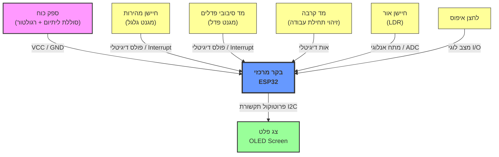

# bacicle_computer
ESP32 priject

```mermaid
graph TD
    %% הגדרת עיצובים ותיבות
    Power["ספק כוח<br>(סוללת ליתיום + רגולטור)"]
    ESP32["בקר מרכזי<br>ESP32"]
    
    %% רכיבי קלט
    In_Speed["חיישן מהירות<br>(מגנט גלגל)"]
    In_Cadence["מד סיבובי פדלים<br>(מגנט פדל)"]
    In_Proximity["מד קרבה<br>(זיהוי תחילת עבודה)"]
    In_LDR["חיישן אור<br>(LDR)"]
    In_Button["לחצן איפוס"]
    
    %% רכיבי פלט
    Out_OLED["צג פלט<br>OLED Screen"]

    %% חיבורי מתח מהספק
    Power -->|VCC / GND| ESP32

    %% חיבורי קלט לבקר
    In_Speed -->|פולס דיגיטלי / Interrupt| ESP32
    In_Cadence -->|פולס דיגיטלי / Interrupt| ESP32
    In_Proximity -->|אות דיגיטלי| ESP32
    In_LDR -->|מתח אנלוגי / ADC| ESP32
    In_Button -->|מצב לוגי I/O| ESP32

    %% חיבורי פלט מהבקר
    ESP32 -->|פרוטוקול תקשורת I2C| Out_OLED

    %% עיצוב ויזואלי בצבעים
    classDef power fill:#f9f,stroke:#333,stroke-width:2px;
    classDef mcu fill:#69f,stroke:#333,stroke-width:3px,font-weight:bold;
    classDef input fill:#ff9,stroke:#333,stroke-width:1px;
    classDef output fill:#9f9,stroke:#333,stroke-width:2px;

    class Power power;
    class ESP32 mcu;
    class In_Speed,In_Cadence,In_Proximity,In_LDR,In_Button input;
    class Out_OLED output;

```
